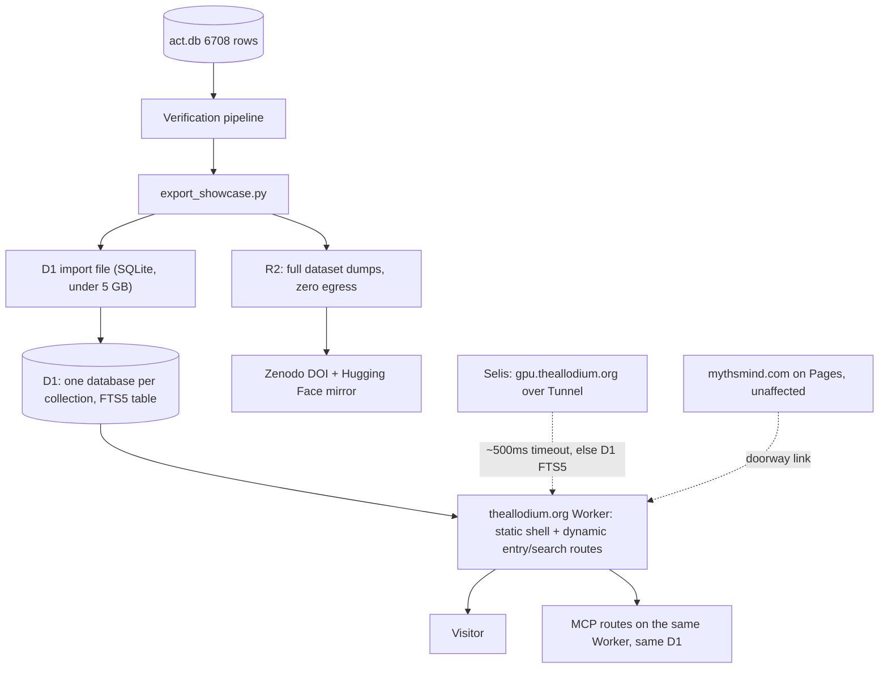

# The Allodium — Worker + D1 architecture

## What changed from the first draft, and why

The original plan pre-rendered one static HTML file per entry (Next.js `generateStaticParams`, deployed to Cloudflare Pages). That works at 5,643 rows but breaks by construction at 250,000 — no amount of file stripping, subdomain-splitting, or Pages-tier upgrade fixes a problem that is architectural. **Entries need to be database rows queried on demand, not files baked at build time.**

Two corrections to the plan's assumptions, confirmed against current Cloudflare docs:

- The static-file ceiling is **per Worker version**, not per domain and not even meaningfully per Pages project in the way originally assumed. Domains are irrelevant to it; one Worker can serve many domains, or many Workers one domain.
- **Pages and Workers Static Assets are different products with different ceilings.** Pages stays capped at 20,000 files even on a paid Workers plan — confirmed by a live Cloudflare Community thread where a 51,000-file Pages deployment failed despite Workers Paid. The 100,000-file tier (Wrangler ≥ 4.34.0) only exists on **Workers Static Assets**. Since dynamic D1-backed routes require Workers anyway, this settles which product to build on.
- A domain-naming correction for later: a collection subdomain would be `programming.theallodium.org`, not `theallodium.programming.org` — the latter would be a subdomain of someone else's `programming.org`. Subdomains of your own zone are free and unlimited either way, but this no longer matters much: since entries aren't files anymore, there is no file-budget reason to prefer subdomains over path-based routing. Path-based routing (`theallodium.org/psychotherapy/`) consolidates SEO authority with no downside now, so that decision is settled in favor of paths.

## Architecture

**Precompute on Selis, serve from Cloudflare, query D1 for anything that can't be baked in advance.** Similarity, summaries, and preview cards still get computed once and written into D1 or R2. Only genuinely unpredictable input needs a live call.

`mythsmind.com` stays exactly as it is, on Pages, with its Next.js static export. Its route count (about 60) is nowhere near any ceiling, and it has no need for D1 or dynamic rendering. Only The Allodium's entry-heavy collections need the Worker architecture.

## Hard numbers

Workers Static Assets, confirmed from `developers.cloudflare.com/workers/platform/limits`:

- Static asset files per Worker version: 20,000 free, 100,000 paid, requires Wrangler ≥ 4.34.0
- Individual file size: 25 MiB on both tiers
- Workers per account: 100 free, 500 paid — never a real constraint across four collections
- Worker script size: 3 MB free, 10 MB paid — the reason to prefer a lean server framework over a React/Next runtime for this Worker specifically

D1, confirmed from `developers.cloudflare.com/d1/platform/pricing` and `/limits`:

- Free: 10 databases, 500 MB max per database, 5 GB per account, 5 million row reads per day, 100,000 row writes per day
- Paid ($5/month base): 50,000 databases, 10 GB per database, 1 TB per account, 25 billion row reads and 50 million row writes per month included
- Unlimited rows per table, bounded only by storage
- Maximum `d1 execute` file import: 5 GB
- FTS5 is supported (confirmed by Cloudflare staff and the official SQL statements doc), with one caveat below

Sizing against the roadmap: 250,000 rows of link-plus-metadata at roughly 1 KB per row is about 250 MB, doubling with an FTS5 index to roughly 500 MB. That sits right at the free tier's 500 MB per-database ceiling. Practically: the psychotherapy collection (5,643 rows) launches free with room to spare, and a single 250,000-row collection can likely still launch free but with no slack — the $5/month plan is the natural upgrade point when a collection nears six figures, not a day-one requirement.

## The FTS5 caveat

D1's FTS5 support has a documented instability: shadow tables (`_data`, `_idx`, `_docsize`, `_config`) can drift out of sync when maintained via `AFTER INSERT/UPDATE/DELETE` triggers on high write volume, surfacing as `SQLITE_CORRUPT_VTAB`. This has been reported and worked around in the wild.

It does not apply cleanly here: Allodium's writes are **batch imports from Selis**, not live per-row user writes. The mitigation is to rebuild the FTS5 table fully on each import (drop and recreate from the content table) rather than maintaining it incrementally via triggers, which sidesteps the exact failure mode that was reported. Keep a `LIKE`-based fallback query path regardless, as a hedge.

One related operational detail: **D1 does not support database export while virtual tables exist.** The R2 dataset dump workflow needs to drop the FTS5 table before exporting a shareable SQLite file, then recreate it afterward — a scripted step, not a blocker.

## Framework choice for the Worker

Open decision, with a lean recommendation: given the 3 MB (free) / 10 MB (paid) Worker script size ceiling, and that entry and search pages are read-only reference content with no need for client-side React hydration, a lightweight server-rendered framework (for example Hono) is the safer default for Allodium's Worker specifically. Next.js via the OpenNext Cloudflare adapter is a viable alternative if reusing MythsMind's React components matters more than bundle size — but it is not the default recommendation here, and it does not affect MythsMind, which stays on classic Pages regardless.

## Phase 1 — Foundation

Goal: the house exists, and the first collection is queryable, not pre-rendered.

- Design the D1 schema and FTS5 virtual table for the psychotherapy collection, matching the public-safe fields already produced by [`scripts/export_showcase.py`](scripts/export_showcase.py)
- Extend that export with verification provenance: `link_status`, `link_checked_at`, and identity/legitimacy flags parsed from `notes`
- Scaffold the Allodium Worker: static assets for the shell (landing, `/standard/`, search UI) plus dynamic routes for entries and queries, path-routed at `theallodium.org/psychotherapy/*`
- Build the export-to-D1-import pipeline, run from Selis, producing a SQLite file under the 5 GB `d1 execute` ceiling
- Stand up FTS5 with the full-rebuild-on-import strategy, plus the `LIKE` fallback
- Write `/standard/` — the methodology page. No competitor in this space publishes their link-integrity and DOI-identity provenance; this is the differentiator
- Add JSON-LD per entry, a sitemap generated from D1, `robots.txt`, `llms.txt`

## Phase 2 — Make it genuinely useful

Goal: fast, faceted, and correct — with Selis asleep.

- Facet queries against D1: modality, client-facing versus clinician-facing, free versus paywalled via `oa_status`, stored versus link-only, combined with FTS5 keyword search, uncapped
- Precomputed related entries: run kNN over [`backend/data/embeddings.npy`](backend/data/embeddings.npy) at build time, write neighbor pairs into a D1 table
- Citation export as BibTeX, RIS, and APA, client-side
- Shareable shortlists encoded in the URL, no accounts, plus a print stylesheet
- OpenGraph cards rendered locally on Selis, pushed to R2, referenced by entry id in the Worker's response headers

Everything here survives Selis being offline; only the ingestion step depends on it.

## Phase 3 — The Selis live layer

Goal: real intelligence, built so its absence is a shrug.

- Expose an optional GPU service at `gpu.theallodium.org` over Cloudflare Tunnel from Selis, extending the pattern already proven by `cloudflared.service` and `mythsmind-search-api.service`
- Worker calls it with a short timeout (roughly 500ms) and falls back to D1 FTS5 on timeout or failure
- Natural-language query translated to facet filters, and grounded answers with citations, using the GPU layer when awake
- Hard refusal rules for clinical advice, with routing to the existing crisis resources

Baseline search always works. It gets smarter when Selis is on.

## Phase 4 — Distribution beyond the website

Goal: usable by people and machines that never visit.

- Publish full dataset dumps (SQLite, CSV, Parquet) of the public-safe catalog to R2 — 10 GB free storage, zero egress fees, meaning bulk downloads cost nothing regardless of volume. An allodium should let visitors cart the whole archive out the front gate
- Publish a versioned, DOI'd metadata-only dataset to Zenodo with a dataset card, mirrored to Hugging Face, linking back to the R2 dumps for bulk access
- Add MCP routes to the same Worker, querying the same D1 database — always up regardless of Selis, and no longer a separate deployment to maintain
- Shrink the cabinet's `/archive` to a doorway

## Phase 5 — Repeatable playbook for future collections

Start every new collection as a new D1 binding and a new path route on the existing Allodium Worker: one codebase, `/psychotherapy`, `/photography`, and so on, routed internally. Split a collection into its own Worker, attached to the same zone with a route pattern, only if its code genuinely diverges enough to warrant separate deployment — the URL never changes, visitors never notice. Worker-count ceilings (100 free, 500 paid) are never the constraint; code complexity is.

One D1 database per collection is the right shape regardless of Worker topology: each D1 database processes queries single-threaded, so per-collection databases also spread query load rather than contending on one.

## Cost

Roughly zero to five dollars a month across the entire four-collection roadmap, plus the two domains already purchased.

- Workers Static Assets: unlimited bandwidth, free tier covers the file counts at issue here comfortably for any single collection under about 20,000 rows, and 100,000 with Wrangler ≥ 4.34.0 on the $5/month plan if a collection's static shell ever needs it — though the shell itself stays tiny regardless, since entries are no longer files
- D1: free through roughly six figures of rows per collection per the sizing math above; $5/month Workers Paid removes the ceiling entirely
- R2: 10 GB free, zero egress, covers media plus dataset dumps
- Redirect Rules for `.com` to `.org` run at the edge, not billed as Worker requests
- Cloudflare Tunnel: free, already running on Selis

## The legal boundary

Publish the index, never the contents.

- Shareable: titles, DOIs, authors, orgs, tags, modality, outbound links, verification status
- Never: stored PDFs, extracted full text, `file_path`, ACBS member content
- [`scripts/export_showcase.py`](scripts/export_showcase.py) already enforces this and excludes `acbs-member-personal-use`
- License index metadata permissively; underlying resources keep their own terms

## Where this sits against the field

- Psychology Tools — around 3,500 tools in 70 languages, commercial and paywalled, no API
- Therapist Aid — freemium worksheets, closed
- Metapsy — versioned meta-analytic databases with minted DOIs, researcher-only, no experience layer
- EBP Directory — registry crosswalk shipped as a web app plus MCP server, no full text
- CBT Toolkit — 217 records, CC BY-NC-SA

The unoccupied position is cross-modality breadth, published verification provenance, an architecture that scales to millions of rows without a rewrite, and an MCP surface. The experiential layer stays on MythsMind.

## Decisions locked

- `theallodium.org` canonical, `.com` redirects via a Cloudflare Redirect Rule
- First collection at `/psychotherapy/`
- Path-based routing for all collections on one Worker and one zone, not subdomains
- Workers Static Assets plus D1, not Pages plus static export, for The Allodium
- MythsMind stays on Pages, untouched

## Open decisions

- Server framework for the Worker: lean (Hono-style) recommended, Next.js via OpenNext as an alternative
- Whether the procedural-experience-per-record idea returns later as a MythsMind cabinet feature, unrelated to Allodium
- Subject of collection two
