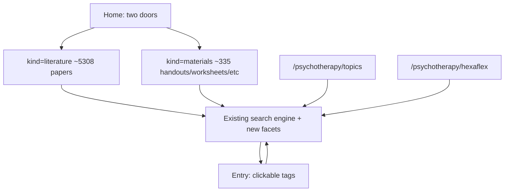

# Phase 2.5: Search structure before the LLM

Phase 2 shipped a working search engine. It did not ship a catalog people can *navigate*. Today [`/psychotherapy/search`](src/views/pages.tsx) is a keyword form plus five facets over 5,643 rows that are ~94% papers; the empty landing refuses to list anything until you type or check a box; result rows hide the fields that sorts already use (date, citations); tags exist on every entry and in FTS meta but are not clickable or filterable.

Phase 3 (NL → facets, GPU) stays additive. This phase makes the **baseline** structure honest, using data already in D1. Same rules as Phase 2: URL is the full state, no JS required to read/search/follow, all filtering stays in [`src/db/repository.ts`](src/db/repository.ts) / [`src/db/facets.ts`](src/db/facets.ts) so Phase 4 MCP reuses it.

**Corpus split (locked):** `kind=literature` means `resource_type = 'paper'`; `kind=materials` means everything else. Do **not** use `credibility_tier` for this. It is almost 1:1 with papers vs. not, and would hide the few non-paper clinician protocols. Keyword search with no `kind` still searches both.

Each milestone gets its own implementation plan only after the previous exit gate, matching Phase 2.

---

## 2.5A: Honest split, richer rows, browse without a keyword

The structural fix. No new snapshot fields.

- **Home** ([`HomePage`](src/views/pages.tsx)): replace the single “Search the index” CTA with two doors. Literature and Materials, each linking to `/psychotherapy/search?kind=…`, with live counts. Keep a quieter “search everything” link.
- **`kind` as a first-class filter** in [`FacetFilters`](src/db/facets.ts) (`literature` | `materials`), parsed from `?kind=`, ANDed with existing facets. Not a sixth checkbox group buried with link-status: a prominent control at the top of the search form (two links or a pair of radios that submit).
- **Browse-without-query:** today `mode === "empty"` returns zero hits unless a facet is on. Change: `kind` alone (or any filter) is enough to paginate that corpus. No `q` and no `kind` and no other filters still shows the two-door prompt rather than dumping 5,643 mixed rows.
- **Richer `SearchHit`** ([`src/contract.ts`](src/contract.ts)): add `published_date`, `citation_count`, `audience`, `credibility_tier` (already on `entries`; SELECT them in the three search paths). Result rows show type, audience, year, citation count, and the existing modality/org/link line, so “newest” / “most cited” sorts are visible, not magical.
- **Entry page:** show `audience` (filterable today, invisible on the page). Structured `authors` when present, falling back to the plain `author` string.

Exit: Workers tests for `kind` SQL + browse-without-query; Playwright covers both doors and a no-JS result row; axe stays green. No ACT export change.

---

## 2.5B: Unused dimensions as facets; tags become links

Once `kind` exists, add the dimensions that actually discriminate *within* each side. Conditional facets so the form does not explode:

| Dimension | Param | When shown | Why |
|-----------|--------|------------|-----|
| Topic tags | `topic` (repeatable, 12 values) | both kinds | 73% coverage; depression/anxiety/trauma/… |
| Resource type | `type` | **materials only** | 11 values; literature is all `paper` |
| Year / decade | `decade` | **literature only** | 79% date coverage on papers, 0% on non-papers; bucket as 2020s / 2010s / 2000s / pre-2000, not 40 year checkboxes |
| Hexaflex | `hexaflex` | both, especially useful with `modality=act` | 6 processes, 80% of ACT entries tagged |

Implementation: extend `FacetFilters` + `buildFacetWhere` with `EXISTS (SELECT 1 FROM entry_tags et JOIN tags t …)` for topic/hexaflex (indexes already on `entry_tags`). Decade is a `published_date` range, not a new column. Cap values per dimension as today (25).

**Clickable tags** on the entry page: each tag becomes a link to `/psychotherapy/search?topic=…` or `?hexaflex=…` (or `?tag=` + category) preserving nothing else, a new search from that tag, not a mutation of the previous query. Zero schema work once 2.5B params exist.

Do **not** add `source_org` as a raw facet (97.7% of rows are OpenAlex/PMC/ACBS/CCI/Europe PMC aggregators). Do **not** add author browse yet (`author` strings are messy; `authors_json` is papers-only and high-cardinality).

Exit: facet combinations including tag JOINs pass repository tests; a known tied-title / pagination integrity case still holds; e2e clicks a tag on an entry and lands on a filtered result list.

---

## 2.5C: Directory landings (the catalog gets a map)

Search stays the engine; these routes are indexes that emit search URLs. Server-rendered, no JS.

- **`GET /psychotherapy/topics`**: the 12 topic tags with counts, each linking to `?topic=`.
- **`GET /psychotherapy/hexaflex`**: the six processes with counts, each linking to `?hexaflex=` (and a materials-biased default, e.g. also `kind=materials`, so client exercises are not buried under papers).
- **Home** grows a short directory strip (Topics, Hexaflex, Search) under the two doors: not a second hero.
- **Within-modality process tags** (CBT skills, DBT modules, ERP/CFT/…) stay off the global facet band. Optional later: when `modality=cbt` is selected, show a compact “CBT skill” facet. Not required to close 2.5C.

Nav: add Topics (and Hexaflex if it fits) next to Search. Sitemap includes the new static routes.

Exit: landings match D1 tag counts; every link is a real search URL; axe green; `/sitemap.xml` count updates.

---

## 2.5D: Interaction polish (only after the structure is right)

Do not start this until 2.5A–C exist, or it polishes the wrong page.

- Facet checkbox changes auto-submit like sort already does ([`public/app.js`](public/app.js) `data-auto-submit`), still a real GET form without JS.
- Pagination: keep prev/next; add a compact page indicator that is not a 226-button list. First/last is enough.
- **More like this as a search mode:** `?like={id}` uses existing `entry_neighbors` (10 precomputed neighbors) as the result set, same result-row component. No new embeddings. Gives “browse from an entry” without Phase 3.

---

## Explicitly out of scope (Phase 3 / 4 / later)

- Natural-language query, GPU tunnel, RAG answers
- Abstract FTS (`abstract_search_enabled` stays off)
- MCP routes (Phase 4), but FacetFilters must stay the single filter type
- Author/institution browse, raw `source_org` facet, turning on overview-as-search
- Accounts, cookies, or JS-required search

## Compatibility

- No snapshot contract bump unless 2.5B somehow needs a new stored column (it should not).
- Keep the `e.id ASC` sort tiebreaker from the link-integrity work.
- Gate style: typecheck + vitest + Playwright/axe per milestone; `audit:links` after any search-SQL change that could affect ordered ids.
