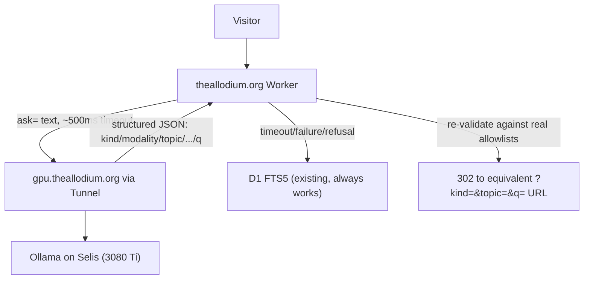

# Phase 3 sub-phase breakdown: the Selis live layer

## Scope decision (per your answers)

Phase 3 as planned here covers **only** "NL query -> facet filters," not "grounded answers with citations." The roadmap's `nl-query-rag` todo bundled two very different-risk features; generating free-text prose about psychotherapy topics is where clinical-advice/crisis risk actually concentrates, and deserves its own scoping pass later with real usage data from 3A/3B in hand. This plan explicitly defers it. See "Deferred" at the end.

Tunnel topology: reuse the single existing Cloudflare Tunnel (`mythsmind-backend`) by adding a second public hostname, rather than a new tunnel/cloudflared process.

## Research already done (facts this plan is built on)

**Existing infra pattern to extend** (`/tank/ACT/backend/`):
- [`mythsmind-search-api.service`](/tank/ACT/backend/mythsmind-search-api.service): systemd unit, `Type=simple`, `Restart=always`, binds `127.0.0.1:8420` only, `Wants=ollama.service`.
- [`app.py`](/tank/ACT/backend/app.py): FastAPI, CORS-restricted, calls local Ollama over HTTP (`OLLAMA_HOST=http://localhost:11434`), with a model-availability fallback list and short timeouts (20s embed / 60s chat), the direct template for a new `allodium-gpu-api` service.
- One Cloudflare Tunnel exists today (confirmed live via the Cloudflare API with the project's existing token): `mythsmind-backend` (`id b86db5e6-210e-4b3c-9b08-7359b9f7318e`), `config_src: cloudflare` (remotely managed, editable via `PUT /accounts/{account}/cfd_tunnel/{id}/configurations`). Current ingress is exactly one rule: `api.mythsmind.com -> http://localhost:8420`, catch-all `http_status:404`. Adding `gpu.theallodium.org -> http://localhost:8421` as a second ingress rule (before the catch-all) needs no new systemd unit, the running `cloudflared.service` already carries every hostname the tunnel is configured for.
- The `theallodium.org` zone (id `38789d538cf8553a49ddb8c22faeb2c7`) currently has exactly one DNS record (an auto-managed AAAA for the Custom Domain Worker route): **no CNAME for a tunnel hostname exists yet**, and the project's current `CLOUDFLARE_API_TOKEN` permissions (per [README.md](/tank/TheAllodium/README.md)) list Zone→Workers Routes→Edit and Zone→Zone→Read for `.org`, but not confirmed DNS→Edit. **First concrete task of 3A: confirm/add DNS→Edit scope on the `.org` zone**, or the CNAME step blocks.

**GPU/model reality on Selis** (this machine, not the LAN 5090 box):
- GPU: RTX 3080 Ti, 12 GB VRAM, effectively idle right now (78 MiB used).
- Ollama already serves (confirmed via `ollama list`): `qwen2.5:7b-instruct-q6_k` (already kept warm-ish by MythsMind's Leaves feature), `qwen3.5:9b-q8_0`, `qwen2.5:14b-instruct-q4_k_m`, `embeddinggemma:300m` (300M, the model that produces `backend/data/embeddings.npy`, the same file `entry_neighbors`/"More like this" is built from), `nomic-embed-text`, `qwen3-embedding:4b/8b`, several others.
- **Important distinction**: `qwen3.6:35b` (used by ACT's `generate_overviews.py`/`verify_legitimacy.py` for offline batch work) runs on a *separate* LAN machine (`10.10.10.2:11435`, the "5090 instance"), not on Selis, and is too large for this 12 GB card anyway. Phase 3's live service must pick from what's actually pulled and fits on the 3080 Ti.
- **Live-measured latency** (direct benchmarking against `localhost:11434` this session, `qwen2.5:7b-instruct-q6_k`, short structured-JSON output): warm requests are fast, 400-700ms wall time (load ~150ms, prompt-eval ~15ms, generation ~350-550ms for ~50-60 tokens). But a cold/idle model reload cost 13-17 **seconds** in two separate test calls. This validates the roadmap's "~500ms timeout, else fall back" design as correct and necessary, not just a nice-to-have: the first NL query after Selis/Ollama has been idle for a while will legitimately time out and fall back to plain FTS5, that's the intended degrade path, not a bug. `keep_alive` tuning on whichever model backs this feature should be set generously (e.g. 30m+) to shrink the cold-start window.
- **Model output is unreliable without server-side normalization**: confirmed directly: the same prompt produced `"modality": ["research papers"]` (not a real modality) and `"topic": ["ACT"]` (wrong case; the real tag is lowercase `"act"`). The GPU response must be treated as an untrusted suggestion, re-validated against real allowlists (existing `sanitizeValues`/`AUDIENCE_SET`/etc. in [`src/db/facets.ts`](/tank/TheAllodium/src/db/facets.ts)) with case-insensitive matching against real D1 values, never applied verbatim. This is the actual engineering challenge of 3B, more than the LLM call itself.
- Shared-resource risk: this is the same GPU/Ollama instance MythsMind's "Leaves on a Stream" feature already uses live. Both are designed to be best-effort/gracefully-degrading, so contention should just mean occasional slower responses or extra fallbacks on both sides, not failures, worth a one-line note in the decision record, not a blocker.

**Existing safety/crisis pattern**: no free-text crisis-keyword detector exists anywhere yet in either repo, the only current "safety" mechanism is prompt-level instruction text in MythsMind's Leaves system prompt. But two curated-tag "heavy topic" gates already exist as design precedent (not directly reusable code, since both key off a closed, authored vocabulary rather than arbitrary user input): ACT's [`ToolkitBuilder.tsx`](/tank/ACT/web/app/toolkit/ToolkitBuilder.tsx) routes to a `crisis_gate` step when a chosen `situation.heavy` flag is set, and [`wayfinder/walker.ts`](/tank/ACT/web/experiences/wayfinder/walker.ts) defines `HEAVY_TAGS = new Set(["suicidality", "trauma", "bpd", "crisis"])` to flag candidate content. 3B's `?ask=` short-circuit is free text, so it still needs a small new keyword/regex list, but `HEAVY_TAGS` is a ready-made, already-vetted starting vocabulary to extend (plus classic hotline triggers: suicide, self-harm, kill myself, etc.) rather than inventing one from nothing. TheAllodium's own crisis copy (988 / Crisis Text Line / findahelpline.com) already lives in [`DisclaimerPage`](/tank/TheAllodium/src/views/pages.tsx).

**CSP confirms the right call flow**: the Worker's CSP is `default-src 'self'` with no `connect-src` override, so a browser-side fetch straight to `gpu.theallodium.org` would be blocked today. This matches the roadmap's own wording ("Worker calls it") rather than MythsMind's client-direct pattern: the Worker calls the GPU service server-side and never exposes the tunnel hostname to the browser. No CSP change needed.

## Sub-phase 3A: GPU bridge spike (infra only, no user-facing change)

Goal: prove the optional path end-to-end before building a feature on it. Mirrors Phase 1A/1C's "risk spike before UI" precedent.

- Confirm/extend the `CLOUDFLARE_API_TOKEN` scope: Zone→DNS→Edit on `theallodium.org` (needed for the CNAME), Account→Cloudflare Tunnel→Edit (needed for the ingress PUT).
- New FastAPI service, `/tank/ACT/backend/allodium_gpu/app.py` (or similar), following `app.py`'s exact pattern: `127.0.0.1:8421` only, `GET /api/health` reporting Ollama reachability + which model resolved, `Restart=always` systemd unit `allodium-gpu-api.service`, `Wants=ollama.service`.
- New script `scripts/configure-gpu-tunnel-route.ts` in TheAllodium (mirrors [`configure-com-redirect.ts`](/tank/TheAllodium/scripts/configure-com-redirect.ts)'s pattern exactly): idempotently adds the `gpu.theallodium.org -> http://localhost:8421` ingress rule to the existing tunnel's configuration (before the catch-all), and creates the CNAME (`gpu.theallodium.org -> <tunnel-id>.cfargotunnel.com`, proxied) if missing.
- Worker: new `src/gpu.ts` with a `pingGpu(env)` helper (`fetch` + short `AbortSignal.timeout`), no UI surface yet, just proves the round trip and the timeout/fallback behavior are real, testable, and never throw.
- Exit gate: `gate:3a` script (secrets scan, typecheck, test, e2e, existing suite unaffected), plus a manual proof recorded in the decision record: health check succeeds from outside Selis's LAN, and stopping the service makes the Worker's ping fail closed (false, not an exception) within budget.
- `docs/phase-3a-decision-record.md`.

## Sub-phase 3B: Natural-language search (`?ask=`)

Goal: a free-text box that gets turned into the existing facet/keyword search, degrading honestly when Selis is offline.

- GPU service: `POST /api/nl-query`, input `{text}`, output a constrained JSON subset of `FacetFilters` (`kind`, `modality[]`, `topic[]`, `hexaflex[]`, `type[]`, `decade[]`, `audience[]`, `q`), via a warm small model (`qwen2.5:7b-instruct-q6_k`, already proven fast and already kept warm by MythsMind's Leaves feature, so reusing it means one fewer model competing for the 12 GB card rather than two).
- Worker-side crisis short-circuit, checked **before** any GPU call, no network dependency: a small local keyword/regex list against the raw `ask=` text, seeded from Wayfinder's existing `HEAVY_TAGS` vocabulary (`suicidality`, `trauma`, `bpd`, `crisis`) plus classic hotline triggers (suicide, self-harm, kill myself, etc.). On match, skip the GPU entirely, render the existing crisis-resources copy inline and prominently above the results (not just the footer link), and still run plain search on whatever's left, never a dead end, never silent.
- Worker-side normalization (the real work, per the "model output is unreliable" finding above): re-run whatever the GPU returns through the existing allowlist/sanitizer pattern in `src/db/facets.ts`, case-insensitively matched against real D1 values (modality/topic/hexaflex/type actually in the corpus), dropping anything that doesn't match rather than trusting it. The GPU is a suggestion generator, the Worker is the sole authority on what filters actually apply.
- UX: `?ask=` lives alongside the existing `?q=` box (not a replacement) on the search page. Success -> 302 to the equivalent `?kind=&topic=&q=...` URL (zero new result-rendering code, keeps "URL is the full state"). Timeout/failure/refusal -> falls back to treating the raw text as a plain `q=` search, with a small "AI search assist is offline, showing keyword results" notice.
- Tests: repository/route tests with a stubbed GPU response covering success, timeout, malformed JSON, hallucinated/mismatched-case facet values, and crisis-phrase short-circuit; Playwright covers the happy path.
- `gate:3b`, `docs/phase-3b-decision-record.md`.

## Sub-phase 3C: Resilience, abuse protection, disclosure

Goal: safe to leave switched on unattended, since this is the first Worker path with a real per-request GPU cost.

- Abuse/cost protection: start with a dashboard-configured Cloudflare Rate Limiting rule scoped to `?ask=` (zero code, same category as the existing `.com` Redirect Rule) rather than adding a new KV binding up front; only add Worker-side counting later if that proves insufficient.
- Observability: a `smoke:gpu` script hitting `gpu.theallodium.org/api/health` post-deploy, and considering whether the existing daily `cron-audit-links.sh` cron should also log GPU health to `evidence/`.
- Disclosure: a short addition to `/standard` describing the optional AI-assisted search, what model, what data it can see (only public contract fields, same forbidden-fields rule as everywhere else), and that it silently degrades to plain search when Selis is offline.
- `docs/gpu-runbook.md` (mirrors [`docs/rollback-runbook.md`](/tank/TheAllodium/docs/rollback-runbook.md)): health-check steps, restart order, what's safe to ignore.
- `gate:3c`, `docs/phase-3c-decision-record.md`.

## Explicitly deferred (not part of this breakdown)

- Grounded answers with citations (RAG synthesis) and the "hard refusal rules for clinical advice" this implies: revisit as its own scoped decision after 3A-3C ship and real usage exists. Note for whenever that happens: the retrieval groundwork already exists for free, the same `embeddings.npy`/`embeddinggemma:300m` pipeline that backs "More like this" could back semantic retrieval for RAG without new infrastructure.
- `r2-dataset-dumps`, `zenodo-doi`, `mcp-on-worker`, `mythsmind-slim`, `collection-two-playbook`: separate Phase 4/5 roadmap items, untouched by this plan.
